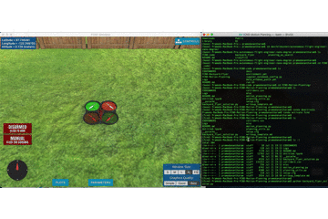

## Project: 3D Motion Planning


---
If you prefer reading a PDF instead of this marked down file, please look into writeup_motion_planning_solution.pdf in the current directory.

# Required Steps for a Passing Submission:
1. Load the 2.5D map in the colliders.csv file describing the environment.
2. Discretize the environment into a grid or graph representation.
3. Define the start and goal locations.
4. Perform a search using A* or other search algorithm.
5. Use a collinearity test or ray tracing method (like Bresenham) to remove unnecessary waypoints.
6. Return waypoints in local ECEF coordinates (format for `self.all_waypoints` is [N, E, altitude, heading], where the drone’s start location corresponds to [0, 0, 0, 0].
7. Write it up.
8. Congratulations!  Your Done!

## [Rubric](https://review.udacity.com/#!/rubrics/1534/view) Points
### Here I will consider the rubric points individually and describe how I addressed each point in my implementation.  

---
### Writeup / README

#### 1. Provide a Writeup / README that includes all the rubric points and how you addressed each one.  You can submit your writeup as markdown or pdf.  

You're reading it! Below I describe how I addressed each rubric point and where in my code each point is handled.

### Explain the Starter Code

#### 1. Test that motion_planning.py is a modified version of backyard_flyer_solution.py for simple path planning. Verify that both scripts work. Then, compare them side by side and describe in words how each of the modifications implemented in motion_planning.py is functioning.

Here are the results of running both `backyard_flyer_solution.py` and `motion_planning.py` scripts. 

* Backyard Flyer Solution Run



* Motion Planning Simple Solution


* Overall, the `motion_planning.py` script contains additional PLANNING state and `plan_path()` method (replacing `calculate_box()` in `backyard_flyer_solution.py`) to find the waypoints
* `plan_path()` method plans a path between start and goal position by invoking supporting methods in `planning_utils.py` with the following high-level summary of steps
    * Initialize all the grids using occupancies specified in `colliders.csv`
    * Initialize start and goal grids
    * Invoke A* search method and find a path from start to goal grid
    * Path returned from A* is used to initialize waypoints starting from start state to goal state
* Two supporting methods called from `planning_utils.py`
    * `create_grid` method accepts occupancy data, drone altitude, and desired safety distance to return back the initialized state space that can be used for planning
    * `a_star` method accepts the grid (state space), a heuristic function, start and goal state and computes an optimal plan to go from start to goal state. The optimal path and corresponding cost are returned
* Once the `plan_path()` returns back while the state is in planning transition, take off is initiate and the drone continues to waypoints and eventually reaching and landing at the goal position.

### Implementing Your Path Planning Algorithm

#### 1. Set your global home position

Implemented a method `read_home_lat_lon()` that accepts the file path for `colliders.csv` and returns lat-long as float values. The method reads the first line of the file and uses string tokenizations with `,` and space to extract lat-lon values. The returned values from the method call is used to set the home position as shown below.

```python
lat0, lon0 = self.read_home_lat_lon('colliders.csv')
self.set_home_position(lon0, lat0, 0)
```

#### 2. Set your current local position
This section of code utilizes `global_to_local()` method to obtain current location position as shown below.

```python
local_home = global_to_local(self.global_position, self.global_home)
```

#### 3. Set grid start position from local position
Grid start position computed using north_offset and east_offset:

```python
grid_start = (int(self.local_position[0] - north_offset), int(self.local_position[1] - east_offset))
```

#### 4. Set grid goal position from geodetic coords
A list containing lat, lon, and alt (set to zero) is used to accept any location on the map. The goal grid is calculated using the `global_to_local()` utility function. Here is the section of code added to accomplish this.

```python
goal_lon_lat = [-122.398250, 37.793875, 0]
local_position_goal = global_to_local(goal_lon_lat, self.global_home)
grid_goal = (int(local_position_goal[0] - north_offset), int(local_position_goal[1] - east_offset))
```


#### 5. Modify A* to include diagonal motion (or replace A* altogether)
I have replaced A* altogether to work with graphs.

Here are enhancements implemented for moving closer to real-world planning. Each enhancement is described with pointers to corresponding code additions. The method description can be found in the method docstring provided in the submission script.

* Graph based planning: Iteration 1 (set as default)
    * Implemented as `plan_path_graph()` method in `motion_planning.py`
    * Graph to represent the configuration space derived using Voronoi graph and grid occupancy
    ```python
    planning_utils.create_graph_and_edges(data, drone_altitude, safety_distance)
    ```
    * A mapping function to find start and goal nodes on the graph that are closest to the specified start and goal positions
    ```python
    planning_utils.find_start_goal(graph, start, goal)
    ```
    * A* algorithm adapted to work with graphs
    ```python
    planning_utils.a_star_graph(G, h, start, goal)
    ```

* Graph based planning: Iteration 2
    * Probabilistic Road Map based planning is implemented as `prob_road_map()` method in `motion_planning.py`
    * Probabilistic Road Map used to construct a graph representation of the configuration space
    ```python
    planning_utils.construct_road_map(data, drone_altitude, safety_distance, num_nodes, neighbors)
    ```
    * Same mapping function and A* algorithm adaptation mentioned in `Graph based planning: Iteration 1` is used for this approach
    * Optimizations implemented in `planning_utils.can_connect_fast` method: Initial implementation of this approach was too slow since it took a long time to check if two points can be connected using all the polygons. Here are the optimizations implemented: (1) KDTree index added to find closest polygon to a point to avoid looping through all the polygons for each point (2) Randomly sampling points on the line joining two points we want to check if they can be connected. The idea is to sample points and check if a line can be drawn from first point to the sampled point. If we have enough samples, then we can be probably confident that we can draw a line between two points.
    * Python script runtime for `construct_road_map()` method is under 2 seconds now. But when working with the simulator, it takes around 200 seconds resulting in timeout error when running with the simulator.

#### 6. Cull waypoints 
To minimize number of waypoints, following method is implemented which contains logic to apply Bresenham and ensure start and goal states are retained in the final waypoints.
```python
planning_utils.condense_waypoints(grid, path)
```
This method starts by adding the first waypoint to the condensed waypoints. For subsequent waypoints, use Bresenham to check if a line can be drawn without hitting any obstacle between last point in the condensed waypoints list and the new waypoint picked from path. If such a line can be drawn, we move on to check the next position in the path. If such a line cannot be drawn, we add the last such point in path to the condensed waypoint list. Final condensed waypoint list is returned to the caller.


### Execute the flight
#### 1. Does it work?
The provided solution works for takeoff and landing from/to any position. I have left some GPS co-ordinates used for testing the solution. 

Known Issue:
* I have implemented Probabilistic Road Map approach which runs under 1.5 seconds as a pure python script (without FCND simulator) but times out when used with FCND simulator. I have described the issue here: https://knowledge.udacity.com/questions/290175 I did not hear back from any mentors and this was a bit discouraging to me since I was left helpless and could not find a resolution for this issue.
